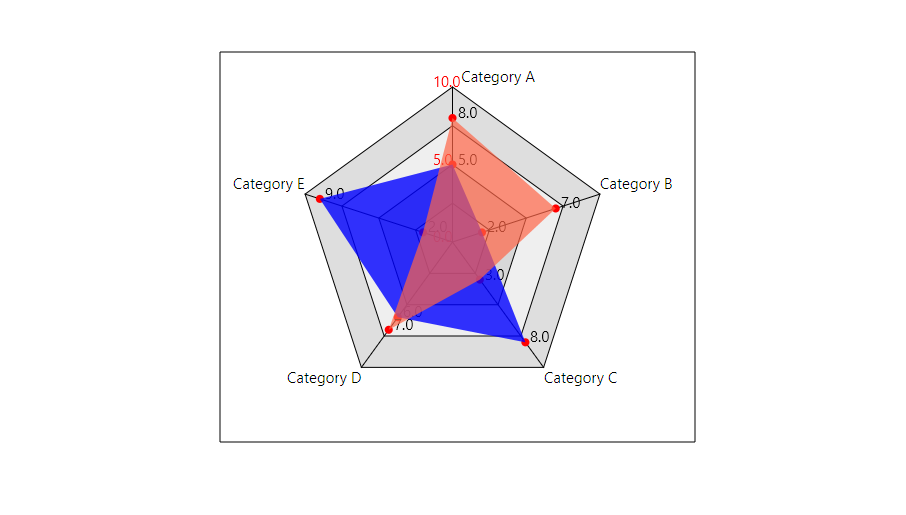

# PolygonChart

Implementation of multi-type Polygon Chart in pure JavaFX. This project was created due to lack of JavaFX default charts and for previous projects needs.

## Installation

You can clone this project and build it by yourself, or you can grab the pre-build jar library and import it directly into your project and you are ready to go.

#### Pre-Build Jar 
[PolygonChart.jar V1.0](https://github.com/JKostikiadis/PolygonChart/raw/master/build/PolygonChart.jar)

## Code Example

Creating a new chart:

```java

String categories[] = { "  Category A", "Category B", "Category C", "Category D", "Category E", "Category F"};
// new PolygonChart(width, height, numberOfTicks, categories, minValue, maxValue)
PolygonChart chart = new PolygonChart(485, 400, 4, categories, 0, 10);
```

The shape of the chart depends on number of categories you will pass as an argument into the constructor. You have create any kind of polygon for example (Image resolution is been reduced to fit the page ) : 


Adding value to a chart:

```java
double values[] = { 5, 2, 8, 6, 9 };

chart.setValues(values);
```
Note : you have to add a value for each category so if the number of categories is 5 then you have to pass a double[5] to the setValue() method.


And you are able to aply more values on chart with different colors and opacity :




The values insertions is animated and can be deactivated if you want by calling ```java chart.setAnimation(false); ```


## Licence
-------
[GNU GENERAL PUBLIC LICENSE](LICENSE)
